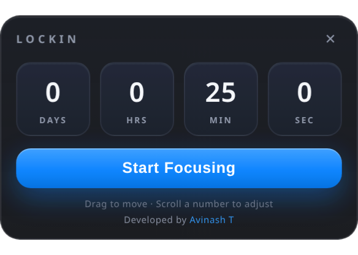
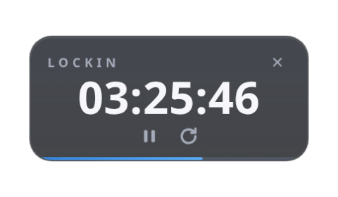

# Lockin

A tiny, premium floating countdown timer for Windows. Set days, hours, minutes and seconds, hit Start, and it floats above everything else while you lock in.

## Screenshots

| Setup | Running |
| :---: | :-----: |
|  |  |

## Features

- **Frameless floating window** — transparent with rounded corners, no black box
- **Always on top** and draggable anywhere on screen
- **Arbitrary durations** — days, hours, minutes, seconds (scroll a number to adjust)
- **Large glanceable timer** with a slim progress bar
- **Icon-only controls** — pause/resume and reset
- **Soft chime** when time's up
- Desktop and Start Menu shortcuts via the installer

## Download

Grab the latest installer from the [**Releases**](https://github.com/AvinashT1625/lockin/releases) page and run it.

> The installer isn't code-signed yet, so Windows SmartScreen may show a warning on first run — click **More info → Run anyway**. Signing is on the roadmap.

## Build from source

You need [Node.js LTS](https://nodejs.org) installed.

```powershell
npm install        # one-time: downloads Electron + Next.js
npm run ui:build   # build the static UI
npm run dist       # package the Windows installer (outputs to release/)
```

For development with hot reload:

```powershell
npm run ui:dev      # start the Next.js dev server
npm start            # launch the Electron shell
```

## Tech

- **UI:** Next.js (static export) + React
- **Shell:** Electron — frameless, transparent, always-on-top window
- **Packaging:** electron-builder (NSIS)

## License

MIT — see [LICENSE](LICENSE).

## Author

Developed by [Avinash T](https://www.linkedin.com/in/avinasht1625/)
